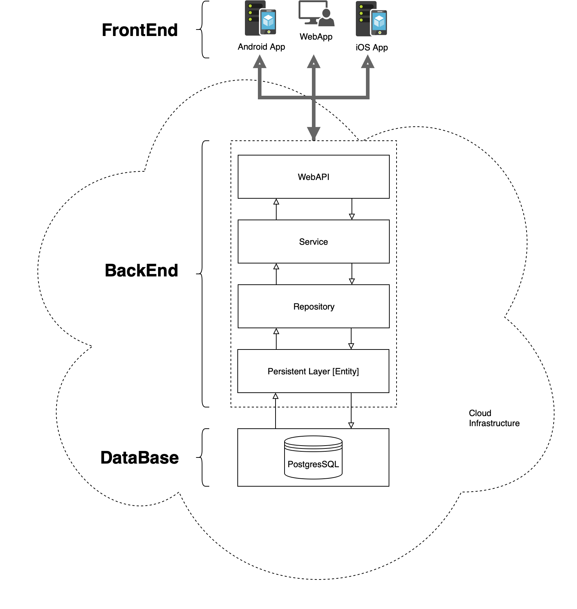
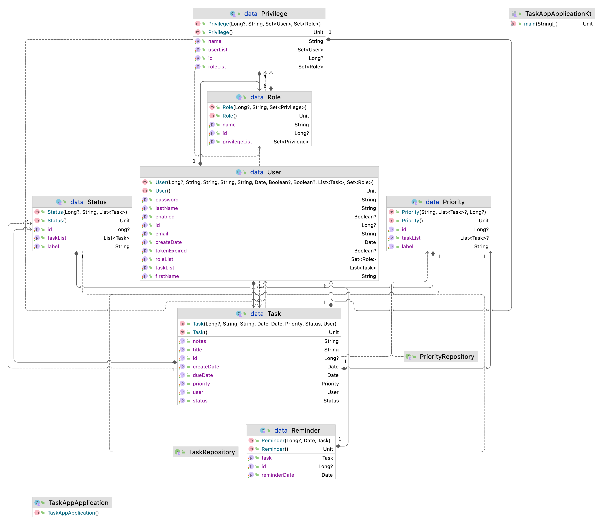
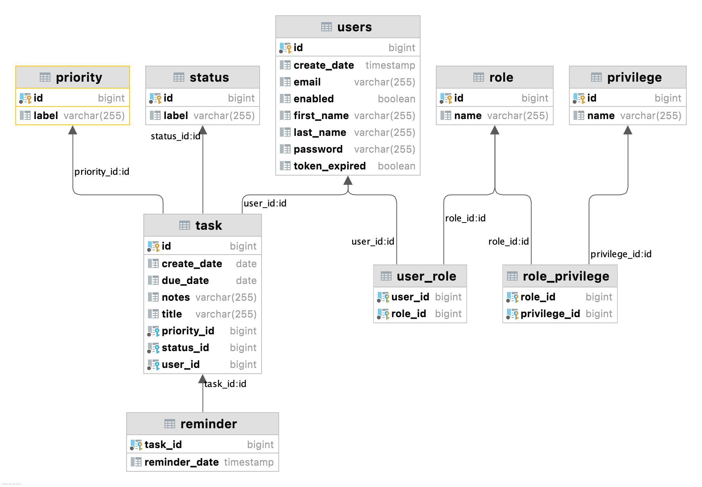

# Backend for TaskApp
The TaskApp represents a distributed system based on layers and interactions with different components.

## App Architecture

## Layer Architecture

The software application is divided into various horizontal layers, with each layer located on top of a lower layer. Each layer is dependent on one or more layers below it (depending on whether the layers are open or closed) but is independent of the layers above it.

### Persistent or Data Layer

The persistence layer contains components for data access, such as an **object-relational mapping** (**ORM**) tool.

The objective is to interact with the data base.

The main objects are the Entities and the relationship between them.

### Data Base

PostgreSQL: The World's Most Advanced Open Source Relational Database

# General terms

## Distributed system

A distributed system is one in which both data and transaction processing are divided between one or more computers connected by a network, each computer playing a specific role in the system.
## The Client-Server Model and Distributed Systems
The client-server model is basic to distributed systems. It is a response to the limitations presented by the traditional mainframe client-host model, in which a single mainframe provides shared data access to many dumb terminals. The client-server model is also a response to the local area network (LAN) model, in which many isolated systems access a file server that provides no processing power.

Client-server architecture provides integration of data and services and allows clients to be isolated from inherent complexities, such as communication protocols. The simplicity of the client-server architecture allows clients to make requests that are routed to the appropriate server. These requests are made in the form of transactions.
